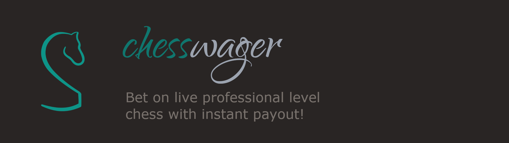

##### Chesswager is a highly performant hybrid dApp that uses smart contracts to securely facilitate betting on the top professional games being played on [LichessTV](https://lichess.org/tv)

---

<!-- https://shields.io/ -->

<!--  -->

ChessWager is live. A mainnet currency is not supported yet, but you can play on the Avalanche testnet. Download [Metamask](https://metamask.io/download/), switch to the [Avalanche Testnet](https://umbria.network/connect/avalanche-fuji-testnet), and [add some test currency](https://faucet.avax-test.network/) to play at https://chesswager.io/.

## [Watch A Demo](https://youtu.be/YG4CmSdyx3Y)

### Performance

- Users can consistently expect payout within 5 seconds of a game ending.
- Database load times are ususally between 50-100ms.
- Less than 25MB of the client's system memory is used under peak loads.

###### lighthouse warns "There may be stored data affecting loading performance in this location: IndexedDB". There seems to be no way to test this app without getting that warning even in a private tab.
###### lighthouse warns "The page loaded too slowly to finish within the time limit. Results may be incomplete." This is because of the continuous data stream from lichess never closing.

### Data Flow

The client relies on a Firestore serverless infrastructure. When a page loads, the client subscribes to the LichessTV API and loads real-time data about chats, bets, and users from the Firestore database. For performance reasons, the browser never loads data directly from the contract.

A few distinct programs run in an isolated cloud environment to interact with the smart contract. One of those programs listens for user payments on the smart contract. Once two users agree to a wager, their Metamask wallets will prompt each user with the appropriate amount. When a user sends a transaction to the contract, the contract listener writes an update to the Firestore database. These changes are reflected immediately in the UI, visually informing users that their payment was received. When a bet is matched, the conditions of the bet are compared in the smart contract. If the values don't perfectly match, the transaction is rejected.

Another isolated backend program subscribes to the LichessTV API. At the end of each game, that program interacts with the smart contract telling it to complete the bet transactions paying the winners or refunding users accordingly.

This system emphasizes speed and responsiveness by using centralized systems for bet pairing and user interactions. However, many benefits of decentralization are maintained through the smart contracts, ensuring that users' funds are secured and only payable to the respective accounts that placed the bet. The service is entirely non-custodial, meaning that chesswager never actually possesses your funds; they are instead stored in the smart contract on the blockchain for the duration of the bet.

### Roadmap

We are nearing the end of phase 2. Our primary features are functional and complete. Most behaviors are thoroughly tested. All that remains are a few tests, making some elements responsive so they look better on smaller displays, new user onboarding guides, and some customer service options so we can know if something goes wrong.

### Primary Technologies

###### Build & Package Management

###### Frontend

###### Backend

[![Avalanche](https://img.shields.io/badge/Avalanche-red.svg?style=flat&labelColor=525252&logoColor=525252&logo=data:image/svg%2bxml;base64,PHN2ZyB3aWR0aD0iMTUwMyIgaGVpZ2h0PSIxNTA0IiBmaWxsPSJub25lIiB4bWxucz0iaHR0cDovL3d3dy53My5vcmcvMjAwMC9zdmciPjxwYXRoIGZpbGw9IiNmZmYiIGQ9Ik0yODcgMjU4aDkyOHY4NDRIMjg3eiIvPjxwYXRoIGZpbGwtcnVsZT0iZXZlbm9kZCIgY2xpcC1ydWxlPSJldmVub2RkIiBkPSJNMTUwMi41IDc1MmMwIDQxNC43Ny0zMzYuMjMgNzUxLTc1MSA3NTEtNDE0Ljc2NiAwLTc1MS0zMzYuMjMtNzUxLTc1MUMuNSAzMzcuMjM0IDMzNi43MzQgMSA3NTEuNSAxYzQxNC43NyAwIDc1MSAzMzYuMjM0IDc1MSA3NTFabS05NjMuODEyIDI5OC44NkgzOTIuOTRjLTMwLjYyNiAwLTQ1Ljc1NCAwLTU0Ljk3OC01LjktOS45NjMtNi40Ni0xNi4wNTEtMTcuMTYtMTYuNzg5LTI4Ljk3LS41NTQtMTAuODggNy4wMTEtMjQuMTY4IDIyLjEzOS01MC43MzVsMzU5Ljg3LTYzNC4zMmMxNS4zMTMtMjYuOTM2IDIzLjA2MS00MC40MDQgMzIuODM5LTQ1LjM4NSAxMC41MTYtNS4zNSAyMy4wNjItNS4zNSAzMy41NzggMCA5Ljc3OCA0Ljk4MSAxNy41MjcgMTguNDQ5IDMyLjgzOSA0NS4zODVsNzMuOTgyIDEyOS4xNDQuMzc3LjY1OWMxNi41MzkgMjguODk3IDI0LjkyNiA0My41NTEgMjguNTg4IDU4LjkzMWExMDkuNTYyIDEwOS41NjIgMCAwIDEgMCA1MS4yODljLTMuNjkgMTUuNDk3LTExLjk5MiAzMC4yNTctMjguNzgxIDU5LjU5MUw2ODcuNTczIDk2NC43MDJsLS40ODkuODU2Yy0xNi42NDggMjkuMTM1LTI1LjA4NSA0My45MDItMzYuNzc4IDU1LjA0Mi0xMi43MyAxMi4xOC0yOC4wNDMgMjEuMDMtNDQuODMyIDI2LjAyLTE1LjMxMyA0LjI0LTMyLjQ3IDQuMjQtNjYuNzg2IDQuMjRabTM2OC4wNjIgMGgyMDguODRjMzAuODEgMCA0Ni4zMSAwIDU1LjU0LTYuMDggOS45Ni02LjQ2IDE2LjIzLTE3LjM1IDE2Ljc5LTI5LjE1LjUzLTEwLjUzLTYuODctMjMuMy0yMS4zNy00OC4zMjMtLjUtLjg1Mi0xLTEuNzE5LTEuNTEtMi42MDFMMTA2MC40MyA3ODUuNzVsLTEuMTktMi4wMTVjLTE0LjctMjQuODU4LTIyLjEyLTM3LjQxMS0zMS42NS00Mi4yNjNhMzYuNzM0IDM2LjczNCAwIDAgMC0zMy4zOTEgMGMtOS41OTQgNC45ODEtMTcuMzQyIDE4LjA4LTMyLjY1NSA0NC40NjJMODU3LjMwNiA5NjQuODkxbC0uMzU3LjYxNmMtMTUuMjU5IDI2LjM0LTIyLjg4NSAzOS41MDMtMjIuMzM1IDUwLjMwMy43MzggMTEuODEgNi44MjYgMjIuNjkgMTYuNzg4IDI5LjE1IDkuMDQxIDUuOSAyNC41MzggNS45IDU1LjM0OCA1LjlaIiBmaWxsPSIjRTg0MTQyIi8+PC9zdmc+)](#)

###### Testing

[![Hardhat](https://img.shields.io/badge/Hardhat-yellow.svg?style=flat&labelColor=525252&logo=data:image/svg%2bxml;base64,PHN2ZyB3aWR0aD0iMjU2IiBoZWlnaHQ9IjE3NyIgeG1sbnM9Imh0dHA6Ly93d3cudzMub3JnLzIwMDAvc3ZnIiBwcmVzZXJ2ZUFzcGVjdFJhdGlvPSJ4TWlkWU1pZCI+PHBhdGggZD0iTTI1NiAxNDguNDA3cy0zOC45OTMtNS43NzctNTkuNTk3LTcuNDM0Yy0xOS43ODgtMS41OS00My4yMzYtMi41MDgtNjguMzkyLTIuNTA4LTI1LjE1NSAwLTQ4LjYwMy45MTgtNjguMzg1IDIuNTA4LTIwLjYxIDEuNjgtNTkuNTk4IDkuNjk1LTU5LjU5OCA5LjY5NXYxMC4wNzZjMCA4Ljk1NiA1Ny4zMDMgMTYuMjMzIDEyNy45ODMgMTYuMjMzIDcwLjY4MSAwIDEyNy45ODMtNy4yNzcgMTI3Ljk4My0xNi4yMzNsLjAwNi0xMi4zMzdaTTg4LjY2IDE0Ljc2NGMtNDYuNzM0IDE2LjY1Mi03Ny45NDMgNjAuOS03Ny45NDYgMTEwLjUxM3YxNi42MTRhMjgzLjk1NCAyODMuOTU0IDAgMCAxIDUwLjgwNC03LjM2NiAyNzQuMjcgMjc0LjI3IDAgMCAxLS4xOC05LjYzNGMuMDE3LTQzLjU5NCAxMC41NC04Mi44MjIgMjcuMzIyLTExMC4xMjdaIiBmaWxsPSIjRjBENTBDIi8+PHBhdGggZD0iTTI0NS4zMDMgMTI1LjI3N0ExMTYuODA2IDExNi44MDYgMCAwIDAgMjE4LjUzIDUwLjY5YTI0My4yMTUgMjQzLjIxNSAwIDAgMSAxMS4xMDUgNzQuMjEyYzAgNC41OC0uMTE3IDkuMTA2LS4zNTIgMTMuNThhMTQzLjg5NyAxNDMuODk3IDAgMCAxIDE1LjgzNSAzLjM1OWwuMTg1LTE2LjU2NFoiIGZpbGw9IiNGRkYwNEQiLz48cGF0aCBkPSJNMjQ1LjMwMyAxMjUuMjc3QTExNi44MDYgMTE2LjgwNiAwIDAgMCAyMTguNTMgNTAuNjlhMjQzLjIxNSAyNDMuMjE1IDAgMCAxIDExLjEwNSA3NC4yMTJjMCA0LjU4LS4xMTcgOS4xMDYtLjM1MiAxMy41OGExNDMuODk3IDE0My44OTcgMCAwIDEgMTUuODM1IDMuMzU5bC4xODUtMTYuNTY0WiIgZmlsbD0iI0ZGRUEwMCIvPjxwYXRoIGQ9Ik0yMTguNTMgNTAuNjg0QzE4Ny4xMDQgMTIuNTkgMTM1LjItMS43NjYgODguNjY2IDE0Ljc2NGMtMTYuNzkzIDI3LjMwNS0yNy4zMSA2Ni41MzMtMjcuMzEgMTEwLjEzMyAwIDMuMjM1LjA1OSA2LjQ0Ni4xNzggOS42MzMgMTcuNDY1LTEuMzQ5IDM3LjY4My0yLjE4MyA1OS4zMzUtMi4zMzRoNy4xNTRhNjg0LjI2IDY4NC4yNiAwIDAgMSAxMDEuMjcgNi4zMDhjLjIyOS00LjQ3OC4zNDYtOS4wMDQuMzU0LTEzLjU4YTI0My4yMSAyNDMuMjEgMCAwIDAtMTEuMTE3LTc0LjI0WiIgZmlsbD0iI0ZGRjA0RCIvPjxwYXRoIGQ9Im0xNzUuMTkzIDU4LjQ0Mi03LjQzMy00Ni40NmE4Ljk1NiA4Ljk1NiAwIDAgMC02LjI5Mi03LjIxNSAxMTcuODEyIDExNy44MTIgMCAwIDAtNjYuMzQ4IDAgOC45NTYgOC45NTYgMCAwIDAtNi4yODYgNy4yMTVsLTcuNDQgNDYuNDZNMTI4LjAyMyAxMzEuMjFoLTcuMTZjLTY3LjM1NS40NzEtMTIwLjgzIDcuNTQ2LTEyMC44MyAxNi4yMDZ2MTIuNTVjLS4xMDguNzM1LjA0OSAxLjQ4NS40NDMgMi4xMTVhMjkuOTIgMjkuOTIgMCAwIDEgMTEuNTMxLTUuMjk1YzEwLjY0LTIuNTg5IDIxLjQ1Ni00LjQgMzIuMzYtNS40MThhMjEuNjY4IDIxLjY2OCAwIDAgMSAxNi45NzcgNS41NDEgNDUuNjcgNDUuNjcgMCAwIDAgMzAuODQzIDExLjk4NWg3MS42NDlhNDUuNjc4IDQ1LjY3OCAwIDAgMCAzMC44NDMtMTEuOTg1IDIxLjY1NyAyMS42NTcgMCAwIDEgMTYuOTgzLTUuNTQ3IDIyNS41MjcgMjI1LjUyNyAwIDAgMSAzMi4zNTQgNS40MTkgMjcuMDUzIDI3LjA1MyAwIDAgMSAxMC45MzcgNC43ODZjLjE4NS4xODQuMzk4LjM0Ny41Ni41MTRhMy4xNDYgMy4xNDYgMCAwIDAgLjQ0OC0yLjEyN3YtMTIuNTVjLjAzOS04LjkyOC01Ny4yNjMtMTYuMTkzLTEyNy45MzgtMTYuMTkzWiIgZmlsbD0iI0ZGRjA0RCIvPjxwYXRoIGZpbGw9IiM2RTZGNzAiIGQ9Im0xNTQuOTggOTMuOTQyLTI2Ljk5MSAxNi42MTR2MjEuNTc4eiIvPjxwYXRoIGZpbGw9IiMwQTBBMEEiIGQ9Ik0xMjguMDE3IDEzMi4xMzR2LTIxLjU3OGwtMjYuOTkyLTE2LjYxNHpNMTAxLjAyNSA4NC4wODVsMjYuOTkyIDE1LjYwNlY0MC40Mjl6Ii8+PHBhdGggZmlsbD0iIzZFNkY3MCIgZD0ibTE1NC45OCA4NC4wODUtMjYuOTkxLTQzLjY2MVY5OS42ODVsMjYuOTkxLTE1LjYwNnoiLz48L3N2Zz4=)](#)
[![Waffle](https://img.shields.io/badge/Waffle-orange.svg?style=flat&labelColor=525252&logoColor=525252&logo=data:image/svg%2bxml;base64,PHN2ZyB4bWxucz0iaHR0cDovL3d3dy53My5vcmcvMjAwMC9zdmciIHhtbG5zOnhsaW5rPSJodHRwOi8vd3d3LnczLm9yZy8xOTk5L3hsaW5rIiB3aWR0aD0iMTQxIiBoZWlnaHQ9Ijk3Ij48ZGVmcz48cGF0aCBpZD0iYSIgZD0iTTQgMzkgNjggMWg0bDY0IDM2aDJsMy0xdjZsLTIgNC02NyAzOWgtNUwyIDQ3YTQgNCAwIDAgMS0yLTR2LTZsNCAyWiIvPjwvZGVmcz48ZyBmaWxsPSJub25lIiBmaWxsLXJ1bGU9ImV2ZW5vZGQiPjxnIGZpbGwtcnVsZT0ibm9uemVybyI+PHVzZSBmaWxsPSIjRkZBRTQ3IiB0cmFuc2Zvcm09InRyYW5zbGF0ZSgwIDcpIiB4bGluazpocmVmPSIjYSIvPjxwYXRoIGZpbGw9IiNGQ0MwNjIiIGQ9Im03MiAxIDY3IDM4YTQgNCAwIDAgMSAwIDdMNzIgODVoLTVMMiA0N2E0IDQgMCAwIDEgMC03TDY4IDFoNFoiLz48cGF0aCBmaWxsPSIjREE3RDE3IiBkPSJtMTEwIDU2LTEgMi0xMyA3djFsLTIgMWgtMmwtMTQtOS0xLTIgMS0xIDE0LTloMmwxNSA5YTIgMiAwIDAgMSAxIDFaIi8+PHBhdGggZmlsbD0iI0Y3OTMxRSIgZD0iTTkzIDY3aDFsMTMtOGgxbC0xNC05aC0xbC0xNSA4IDIgMSAxMyA4WiIvPjxwYXRoIGZpbGw9IiNEQTdEMTciIGQ9Im02MiA1Ny0xIDEtMTIgOGgtMWwtMSAxaC0ybC0xNC05LTEtMSAxLTIgMTQtOWgybDE0IDlhMiAyIDAgMCAxIDEgMloiLz48cGF0aCBmaWxsPSIjRjc5MzFFIiBkPSJNNDUgNjdoMWwxMy03IDItMS0xNS05aC0xbC0xNCA5IDIgMSAxMiA3WiIvPjxnPjxwYXRoIGZpbGw9IiNEQTdEMTciIGQ9Im04NiA3MC0xIDItMTMgNy0yIDFoLTJsLTE0LTgtMS0yIDEtMiAxNC04aDJsMTUgOGEyIDIgMCAwIDEgMSAyWiIvPjxwYXRoIGZpbGw9IiNGNzkzMUUiIGQ9Ik02OSA4MWgxbDEzLTggMS0xLTE0LThoLTFsLTE0IDggMSAxIDEzIDhaIi8+PC9nPjxnPjxwYXRoIGZpbGw9IiNEQTdEMTciIGQ9Im04NiAxNi0xIDItMTIgNy0yIDFoLTJsLTE0LTgtMS0yIDEtMiAxNC05aDJsMTQgOWEyIDIgMCAwIDEgMSAyWiIvPjxwYXRoIGZpbGw9IiNGNzkzMUUiIGQ9Ik02OSAyNmgxbDEzLTcgMi0xLTE1LTktMTUgOSAyIDEgMTIgN1oiLz48cGF0aCBmaWxsPSIjREE3RDE3IiBkPSJtMTEwIDI5LTEgMi0xMiA3LTEgMS0yIDFoLTJsLTE0LTktMS0yIDEtMSAxNC05aDJsMTUgOWEyIDIgMCAwIDEgMSAxWiIvPjxwYXRoIGZpbGw9IiNGNzkzMUUiIGQ9Ik05MyA0MGgxbDEzLThoMWwtMTQtOWgtMWwtMTQgOCAxIDEgMTMgOFoiLz48cGF0aCBmaWxsPSIjREE3RDE3IiBkPSJtODYgNDMtMSAyLTEyIDdoLTFsLTEgMWgtMmwtMTUtOHYtNGwxNS04aDJsMTQgOGEyIDIgMCAwIDEgMSAyWiIvPjxwYXRoIGZpbGw9IiNGNzkzMUUiIGQ9Ik02OSA1NGgxbDEzLTggMi0xLTE1LThoLTFsLTE0IDggMSAxIDEzIDhaIi8+PHBhdGggZmlsbD0iI0RBN0QxNyIgZD0ibTExMCA1Ni0xIDItMTMgN3YxbC0yIDFoLTJsLTE0LTktMS0yIDEtMSAxNC05aDJsMTUgOWEyIDIgMCAwIDEgMSAxWiIvPjxwYXRoIGZpbGw9IiNGNzkzMUUiIGQ9Ik05MyA2N2gxbDEzLThoMWwtMTQtOWgtMWwtMTUgOCAyIDEgMTMgOFoiLz48cGF0aCBmaWxsPSIjREE3RDE3IiBkPSJtNjIgNTctMSAxLTEyIDhoLTFsLTEgMWgtMmwtMTQtOS0xLTEgMS0yIDE0LTloMmwxNCA5YTIgMiAwIDAgMSAxIDJaIi8+PHBhdGggZmlsbD0iI0Y3OTMxRSIgZD0iTTQ1IDY3aDFsMTMtNyAyLTEtMTUtOWgtMWwtMTQgOSAyIDEgMTIgN1oiLz48Zz48cGF0aCBmaWxsPSIjREE3RDE3IiBkPSJtODYgNzAtMSAyLTEzIDctMiAxaC0ybC0xNC04LTEtMiAxLTIgMTQtOGgybDE1IDhhMiAyIDAgMCAxIDEgMloiLz48cGF0aCBmaWxsPSIjRjc5MzFFIiBkPSJNNjkgODFoMWwxMy04IDEtMS0xNC04aC0xbC0xNCA4IDEgMSAxMyA4WiIvPjwvZz48Zz48cGF0aCBmaWxsPSIjREE3RDE3IiBkPSJtMTMzIDQzLTEgMi0xMiA3aC0xbC0xIDFoLTJsLTE1LTgtMS0yIDEtMiAxNS04aDJsMTQgOGEyIDIgMCAwIDEgMSAyWiIvPjxwYXRoIGZpbGw9IiNGNzkzMUUiIGQ9Ik0xMTYgNTRoMWwxMy04IDEtMS0xNC04aC0xbC0xNCA4IDEgMSAxMyA4WiIvPjwvZz48Zz48cGF0aCBmaWxsPSIjREE3RDE3IiBkPSJtNjMgMjktMSAyLTEyIDctMSAxLTIgMWgtMWwtMTUtOS0xLTIgMS0xIDE1LTloMmwxNCA5YTIgMiAwIDAgMSAxIDFaIi8+PHBhdGggZmlsbD0iI0Y3OTMxRSIgZD0iTTQ2IDQwaDFsMTMtOGgxbC0xNC05aC0xbC0xNCA4IDEgMSAxMyA4WiIvPjwvZz48Zz48cGF0aCBmaWxsPSIjREE3RDE3IiBkPSJtMzkgNDMtMSAyLTEyIDctMSAxLTEgMWgtMkw3IDQ1bC0xLTIgMS0xIDE1LTloMmwxNCA5YTIgMiAwIDAgMSAxIDFaIi8+PHBhdGggZmlsbD0iI0Y3OTMxRSIgZD0iTTIyIDU0aDFsMTMtOGgxbC0xNC05aC0xTDggNDVsMSAxIDEzIDhaIi8+PC9nPjwvZz48L2c+PHBhdGggZmlsbD0iI0ZGRiIgZD0ibTIzIDY2IDExLTYgNC0yaDEwbDQgMyA2LTJhMTAgMTAgMCAwIDEgMTMgOHYybC0xIDFjNiAyIDExIDcgMTMgMTR2MWwtNiA1LTExIDYtNDMtMzBaIi8+PC9nPjwvc3ZnPg==)](#)

###### Cloud

[![GKE](https://img.shields.io/badge/GKE-blue.svg?style=flat&labelColor=525252&logoColor=525252&logo=data:image/svg%2bxml;base64,PHN2ZyB3aWR0aD0iMTI4IiBoZWlnaHQ9IjEyOCIgeG1sbnM9Imh0dHA6Ly93d3cudzMub3JnLzIwMDAvc3ZnIiB4bWxuczp4bGluaz0iaHR0cDovL3d3dy53My5vcmcvMTk5OS94bGluayI+PGRlZnM+PGxpbmVhckdyYWRpZW50IGlkPSJiIiBncmFkaWVudFVuaXRzPSJ1c2VyU3BhY2VPblVzZSIgeTE9IjcuMDMiIHgyPSIwIiB5Mj0iMTIwLjc5Ij48c3RvcCBzdG9wLWNvbG9yPSIjNDM4N2ZkIi8+PHN0b3Agb2Zmc2V0PSIxIiBzdG9wLWNvbG9yPSIjNDY4M2VhIi8+PC9saW5lYXJHcmFkaWVudD48Y2xpcFBhdGggaWQ9ImMiPjx1c2UgeGxpbms6aHJlZj0iI2EiLz48L2NsaXBQYXRoPjxwYXRoIGlkPSJhIiBkPSJNMjcuNzkxIDExNS4yMiAxLjU0MSA2OS43NWExMS41IDExLjUgMCAwIDEgMC0xMS40OTlsMjYuMjUtNDUuNDdhMTEuNDk5IDExLjQ5OSAwIDAgMSA5Ljk1OS01Ljc1aDUyLjVjNC4xMDggMCA3LjkwNCAyLjE5MiA5Ljk1OSA1Ljc1bDI2LjI1IDQ1LjQ3YTExLjUgMTEuNSAwIDAgMSAwIDExLjQ5OWwtMjYuMjUgNDUuNDdhMTEuNDk4IDExLjQ5OCAwIDAgMS05Ljk1OSA1Ljc0OWgtNTIuNWExMS41IDExLjUgMCAwIDEtOS45NTgtNS43NDkiLz48L2RlZnM+PHBhdGggZD0iTTI3Ljc5MSAxMTUuMjIgMS41NDEgNjkuNzVhMTEuNSAxMS41IDAgMCAxIDAtMTEuNDk5bDI2LjI1LTQ1LjQ3YTExLjQ5OSAxMS40OTkgMCAwIDEgOS45NTktNS43NWg1Mi41YzQuMTA4IDAgNy45MDQgMi4xOTIgOS45NTkgNS43NWwyNi4yNSA0NS40N2ExMS41IDExLjUgMCAwIDEgMCAxMS40OTlsLTI2LjI1IDQ1LjQ3YTExLjQ5OCAxMS40OTggMCAwIDEtOS45NTkgNS43NDloLTUyLjVhMTEuNSAxMS41IDAgMCAxLTkuOTU4LTUuNzQ5IiBmaWxsPSJ1cmwoI2IpIi8+PHBhdGggb3BhY2l0eT0iLjA3IiBjbGlwLXBhdGg9InVybCgjYykiIGQ9Ik0xMjQuMDUgODIuODYgODkuNjMgNDguNDQgNjQgMzcgMzkuNSA1MC4zMWwtMS4wMjcgMjkuMzQgNDIuNTQ3IDQyLjU0IDE2LjY1LS4xNXoiLz48cGF0aCBkPSJtODkuMDMgNDcuOTkzLTIzLjY3Ni0xMy42N2EyLjcgMi43IDAgMCAwLTIuNjk5IDBsLTIzLjY3NiAxMy42N2EyLjY5OCAyLjY5OCAwIDAgMC0xLjM0OSAyLjMzN3YyNy4zMzljMCAuOTY0LjUxNCAxLjg1NSAxLjM0OSAyLjMzN2wyMy42NzYgMTMuNjdhMi43IDIuNyAwIDAgMCAyLjY5OSAwbDIzLjY3Ni0xMy42N2EyLjY5OCAyLjY5OCAwIDAgMCAxLjM0OS0yLjMzN1Y1MC4zM2MwLS45NjQtLjUxNC0xLjg1NS0xLjM0OS0yLjMzN20tMy4yNDggMjcuMDYtOC4yNi00Ljc2OVY1Ny43MjFsLTEyLjE5OCA3LjA0djE0LjA5bDEwLjg3OS02LjI4MSA4LjI2IDQuNzY5LTIwLjQ1OSAxMS44MTItMjAuNDU5LTExLjgxMiA4LjI2LTQuNzY5IDEwLjg4IDYuMjgxdi0xNC4wOWwtMTIuMTk4LTcuMDR2MTIuNTYzbC04LjI2IDQuNzY5VjUxLjQyOWwyMC40NTktMTEuODEydjkuNTM4bC0xMC44OCA2LjI4MSAxMi4xOTggNy4wNCAxMi4xOTgtNy4wNC0xMC44NzktNi4yODF2LTkuNTM4bDIwLjQ1OSAxMS44MTJ2MjMuNjI0IiBmaWxsPSIjZmZmIi8+PC9zdmc+)](#)
[![Cloud Build](https://img.shields.io/badge/Cloud_Build-steelblue.svg?style=flat&labelColor=525252&logoColor=steelblue&logo=data:image/svg%2bxml;base64,PHN2ZyB2ZXJzaW9uPSIxLjAiIHhtbG5zPSJodHRwOi8vd3d3LnczLm9yZy8yMDAwL3N2ZyIgd2lkdGg9IjE4Ni42NjciIGhlaWdodD0iMTg2LjY2NyIgZmlsbD0iIzhmYmFmZiIgdmlld0JveD0iMCAwIDE0MCAxNDAiPjxwYXRoIGQ9Ik0zOC41IDcuOGMtNCAxLjQtNi4zIDMuOC0xMC45IDExLjctMi41IDQuNC01IDguNy01LjYgOS41LS41LjgtMi40IDQuMi00LjMgNy41LTEuOCAzLjMtNi40IDExLjQtMTAuMiAxOC04LjYgMTQuOC04LjcgMTYuMS0xLjcgMjcuNiAyLjcgNC42IDUuOSAxMC4yIDcuMSAxMi40IDEuMiAyLjIgMy4xIDUuNiA0LjMgNy41IDIuNCA0LjEgMTAuNSAxOC4zIDEyLjQgMjIuMS44IDEuNCAyLjggMy45IDQuNiA1LjVsMy4zIDIuOSAzMCAuM2MxNi41LjIgMzEuNC4xIDMzLS4yIDQuNS0uOSA4LTQuOSAxNS4yLTE3LjYgMy42LTYuMyA5LTE1LjYgMTEuOS0yMC43IDMtNSA1LjQtOS40IDUuNC05LjcgMC0uMyAxLjQtMi45IDMuMS01LjcgNC4zLTYuOSA0LjEtMTAuNi0uNy0xOS40LTIuMS0zLjktNC4yLTcuMi00LjYtNy4zLS40LS4yLS44LS43LS44LTEuMnMtMi4yLTQuNi00LjgtOS4yYy0yLjYtNC42LTUuMS05LTUuNS05LjgtLjQtLjgtMS4zLTIuNC0yLTMuNXMtMy4yLTUuNC01LjUtOS41Yy03LTEyLjItNC42LTExLjUtNDAuNy0xMS43LTE3LS4xLTMxLjkuMi0zMyAuNXpNNzQgMzdjLjMuNCAyLjUgMS44IDUgM3M0LjcgMi42IDUgMi45Yy4zLjQgMi42IDEuOCA1LjMgMy4xIDIuNiAxLjQgNS42IDMuMiA2LjggNC4xIDIgMS41IDEuOSAxLjYtNC4yIDUuMi0zLjQgMi02LjcgMy43LTcuMyAzLjctLjYgMC0zLjctMS42LTYuOS0zLjVTNzEuMiA1MiA3MC4zIDUyYy0uOCAwLTQuNSAxLjYtOC4yIDMuN2wtNi43IDMuNi02LjgtMy44LTYuOC0zLjhMNDQgNTBjMS4zLTEgNC42LTIuOSA3LjQtNC40IDIuOC0xLjUgOC00LjUgMTEuNi02LjYgNi4xLTMuNiA5LjUtNC4yIDExLTJ6TTUyLjMgNjEuOWMxLjQgMS4xIDEuNyAzIDEuNyA5LjZ2OC4zbDYuOCAzLjggNi43IDMuOS4zIDguMi4zIDguMi01LjMtMy4xYy0yLjktMS42LTkuMS01LjEtMTMuOC03LjhsLTguNS00LjgtLjMtMTYuNy0uMi0xNi43IDUuMiAyLjhjMi45IDEuNiA2LjEgMy41IDcuMSA0LjN6bTQ3LjUgMTcuNi0uMyA4LjZMODYgOTUuOWwtMTMuNSA3LjgtLjMtNy42Yy0uMy04LjUtLjItOC43IDkuNS0xMy44bDUuMy0yLjhWNjIuNGw0LjMtMi41YzktNS4xIDguMi01LjQgOC41IDMuMy4xIDQuMi4xIDExLjYgMCAxNi4zek03Mi41IDU3bDIuNyAxLTIgMy4zYy00LjMgNi45LTYuMyAxMC40LTguNCAxNC40LTIuNCA0LjctMy4zIDUuMS02IDIuNi0xLjQtMS4yLTEuOC0zLjEtMS44LTguNCAwLTcuMyAwLTcuNCA5LjUtMTIuMyAzLjYtMS45IDIuOC0xLjggNi0uNnptOCA0LjZjMi4zIDEuNSAyLjUgMi4zIDIuNSA4LjQgMCA3LjUtLjQgOC04LjIgMTItNCAyLjEtNSAyLjItNy4zIDEuMi0yLjctMS4yLTIuNy0xLjMtLjktNCAzLTQuNSAxMC40LTE3LjYgMTAuNC0xOC40IDAtMS4yLjgtMSAzLjUuOHoiLz48L3N2Zz4=)](#)

### Contributions

This repository's branch structure is designed similarly to the standard [gitflow](https://github.com/nvie/gitflow) model with the addition of a "test" branch between develop and release. The develop, test, and main branches each have their own backend environment. The test branch serves as a safe way for us to test features.

- _Develop_ could have any environmental changes at any time.
- _Test_ will only have user testing and controlled tests running on its environment during the build process.
- _Main_ operates in the production environment.

If you would like to contribute to this repo, start by opening an issue so we can discuss the feature. Create a feature branch from develop and make a pull request into develop when you're done.

For style and linting, there is a prettier config file as well as a tailwind plugin for prettier in the dev dependencies. We use Cypress for our frontend testing, Jest for the backend, and hardhat+waffle on smart contracts. The testing requirements are that all behaviors should be tested before release, not necessarily every line of code.

### Values

Values are subject to evolution and change at this point, but it is paramount to establish the desired culture early. You may have heard of some of these before, but I'm taking what I like from top companies:

1. **Customer Obsession** - Amazon is famous for this. Without any customers, there's no business. Customers are simply the most important part of the equation. That means keeping our services clean and friendly. We will strive to deliver the best experience through customer service and a quality product.
2. **Code Standards** - Robert "Uncle Bob" Martin influenced this one. We promise never to release code whose behavior is not well tested. A bug will never knowingly make its way into production.
3. **Don't Be Evil** - Google used to say this, and we agree that businesses should not leave a negative impact. We will never implement anti-consumer mechanisms or knowingly cause harm.
4. **Treat Everyone with Respect and Dignity** - We will always be respectful internally and externally, even in the face of obscenity. That means customers, employees, and strangers.

###### Feedback is welcome
